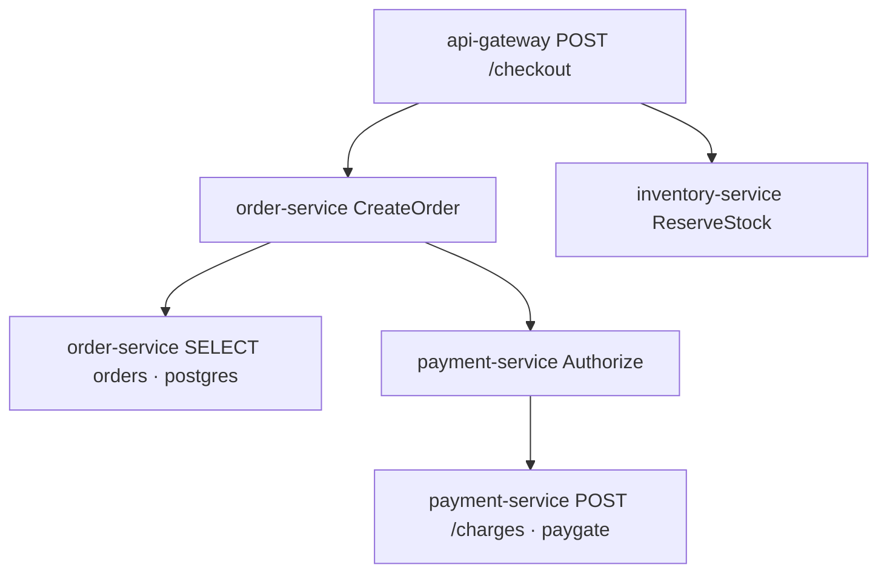

# incident-response-agent

프로덕션 장애를 조사하는 에이전트를 만드는 중임. 로그, 메트릭, 트레이스, 배포를 실제 시스템에 붙이는 대신 checkout 하나를 가짜로 만들고, 거기에 고장을 넣어서 조사하게 함.

## 세계

정상 checkout은 이런 span임.



`trace_id`랑 `request_id`는 따로 둠. 부모 span 시간은 자식을 포함해야 하고, 만든 결과는 `check_trace_consistency`로 확인함.

고장은 `world/faults.py`에 다섯 개 있음.

배포 회귀(`inject_deployment_regression`)는 payment를 배포한 뒤부터 그 서비스 server span만 실패시킴. paygate 호출은 성공으로 남고, gateway 에러율은 배포 이후 버킷에서 올라감. 의존성 지연(`inject_dependency_latency`)은 paygate만 늘림. 배포는 없고 payment 자체 처리 시간이랑 CPU도 그대로임. timeout을 주면 실패는 paygate span에 남음.

설정 오류(`inject_bad_configuration`)는 배포를 먼저 성공으로 남기고, feature flag나 env가 바뀐 시각부터 server span을 실패시킴. 실행 중인 버전은 안 바뀜. 커넥션 풀(`inject_connection_pool_exhaustion`)은 order의 postgres 호출만 타임아웃임. pool은 1.0, CPU는 0.3이고 배포나 설정 변경은 없음. 트래픽 스파이크(`inject_traffic_spike`)는 gateway 요청 수를 늘리고 CPU랑 memory를 올림. 실패 유형은 `saturated`임. paygate, postgres는 정상이고 배포도 없음.

세계는 `save_world` / `load_world`로 SQLite 파일 하나에 넣음. span, 배포, 설정 변경, 로그, metric이 같이 들어감.

조치는 세계에도 반영됨. payment rollback은 그 시각 이후 요청의 에러를 내리고, `restart_service`는 에러를 그대로 둠. high-risk 조치는 `propose_action`이 `PENDING_APPROVAL`까지만 만들고, `approve_action` 이후에 rollback이나 restart가 적용됨.

## 조사

도구는 그 파일을 읽음. metric, 배포, 로그, trace, 설정 변경을 시간 범위로 가져오고, 서비스 목록이랑 에러율, 의존성 지연은 span에서 계산함. 반환마다 evidence id가 붙음. trace 하나는 부모 다음에 자식이 오게 돌려줌.

runbook이랑 과거 장애도 같은 세계에 붙어 있음. 검색은 키워드 겹침이랑 문자 trigram을 반반 섞음. 카탈로그 8개 질의로 `evaluate_retrieval()`을 돌려 보면 키워드만 써도 Recall@1, Recall@5, MRR이 1.0이라, 이 데이터로는 hybrid가 더 낫다고 말하긴 어려움.

Baseline Agent는 도구를 직접 고르고, 최종 보고서에 적은 evidence id가 실제 도구 결과에 있을 때만 제출을 받음. 테스트는 API를 안 치고 이 루프만 돌림.

```powershell
python -m unittest discover -s tests -v
```

## 서버

```powershell
pip install -e .
uvicorn incident_agent.api.app:app --app-dir src --port 8000
```

Swagger는 http://127.0.0.1:8000/docs 임. incident는 `payment_deploy_regression`이랑 `paygate_latency`로 만들고, 조사한 다음 승인하거나 거절함. 조사랑 평가 엔드포인트는 `OPENAI_API_KEY`가 있을 때 OpenAI를 호출함.

`POST /eval/run`은 시나리오를 실제로 조사한 뒤 채점함. `limit` 기본값은 1이고, 36개를 한 번에 보려면 `limit=36`임. 허용된 조치가 있는 시나리오만 복구 점수가 나옴. 평가 코드가 그 조치를 승인하고, 재생한 span이 장애 시각 이후에도 이전 버전인데 에러가 없으면 1임. 이 점수는 그 실행의 결과임. OpenAI로 재서 저장해 둔 baseline 표는 아직 없음.

## 아직

Improved Agent. 가설을 기록하게 한 다음에 snapshot 점수를 매길 생각이고, 검색을 신경망 임베딩으로 바꿨을 때 비교도 그때 재면 됨. baseline 표도 그 전에 OpenAI로 한 번 재서 남겨야 함.
